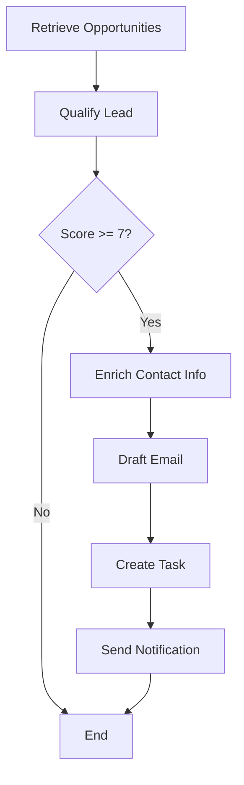

# Business Agent 2.0 - Opportunity Scout

> An autonomous AI agent that discovers business opportunities, qualifies leads, enriches contact information, and automates outreach.

## 🎯 What It Does

The Opportunity Scout Agent:
1. **Ingests data** from multiple sources (RSS feeds, Reddit, websites)
2. **Qualifies leads** using AI analysis with explainable reasoning
3. **Enriches contacts** with Hunter.io and Clearbit integration
4. **Automates outreach** through Trello, Notion, and Discord

## 🏗️ Architecture

### Technology Stack
- **AI Framework**: LangChain + LangGraph for workflow orchestration
- **LLM**: Ollama (local inference with Phi/Mistral models)
- **Vector DB**: Qdrant for semantic search
- **Protocol**: Model Context Protocol (MCP) for standardized tool interfaces

### Project Structure
```
Business-Agent-2.0/
├── core_engine/
│   ├── agent.py              # Main LangGraph agent
│   └── agent_mcp_example.py  # MCP-enabled agent
├── mcp_servers/              # MCP server implementations
│   ├── ingestion_server.py   # Data collection tools
│   ├── enrichment_server.py  # Lead enrichment tools
│   └── task_management_server.py  # Action/notification tools
├── perception/
│   └── ingest.py             # Data ingestion module
├── tools/                    # Legacy tool implementations
├── run.py                    # Main runner script ✨NEW
└── .env                      # Configuration
```

## 🚀 Quick Start

### Prerequisites
1. **Docker** (for Qdrant)
2. **Ollama** with models installed:
   ```bash
   ollama pull phi
   ollama pull mistral
   ```
3. **Python 3.10+** with virtual environment

### Installation

1. **Clone and setup environment**:
   ```bash
   cd Business-Agent-2.0
   python -m venv .venv
   .venv\Scripts\activate  # Windows
   pip install -r requirements.txt
   ```

2. **Start Qdrant**:
   ```bash
   docker-compose up -d
   ```

3. **Configure environment**:
   - Edit `.env` file with your API keys
   - Required: `HUNTER_API_KEY` for enrichment
   - Optional: Reddit, Trello, Notion, Discord credentials

4. **Create test data**:
   ```bash
   python create_test_data.py
   ```

### Running the Agent

**Easy Way** (Interactive Menu):
```bash
python run.py
```

**Direct Execution**:
```bash
# Run main agent
python core_engine/agent.py

# Run MCP-enabled agent
python core_engine/agent_mcp_example.py

# Ingest data
python perception/ingest.py
```

## 📊 Features

### Explainable AI (XAI)
The agent provides transparent lead qualification with:
- **Reasoning traces** showing decision-making process
- **Positive/negative factors** extracted from data
- **Confidence levels** based on information completeness
- **Source quotes** supporting the analysis

### Model Context Protocol (MCP)
Standardized tool interfaces that work with:
- Claude Desktop
- Claude API
- Other MCP-compatible AI systems

**MCP Tools Available**:
- **Ingestion**: RSS feeds, Reddit, web scraping
- **Enrichment**: Company info, email finding, verification
- **Task Management**: Trello cards, Notion tasks, Discord messages

## 🔧 Configuration

### Environment Variables

```bash
# LLM Configuration
OLLAMA_MODEL=phi  # or mistral
OLLAMA_BASE_URL=http://localhost:11434

# Vector Database
QDRANT_URL=http://localhost:6333
QDRANT_COLLECTION_NAME=opportunity_scout_collection

# APIs (Optional)
HUNTER_API_KEY=your_key
REDDIT_CLIENT_ID=your_id
REDDIT_CLIENT_SECRET=your_secret
TRELLO_API_KEY=your_key
TRELLO_TOKEN=your_token
DISCORD_BOT_TOKEN=your_token
```

## 📖 Usage Examples

### Example 1: Find Hiring Opportunities
```python
from core_engine.agent import app

initial_state = {
    "goal_prompt": "Find posts where someone is looking to hire a web developer"
}

result = app.invoke(initial_state)
print(f"Lead Score: {result['lead_analysis']['score']}/10")
```

### Example 2: Ingest Reddit Data
```bash
python perception/ingest.py
# Will ingest from r/forhire, r/freelance, etc.
```

### Example 3: Use MCP Servers
```bash
# Start servers (in separate terminals)
python mcp_servers/ingestion_server.py
python mcp_servers/enrichment_server.py
python mcp_servers/task_management_server.py

# Run MCP-enabled agent
python core_engine/agent_mcp_example.py
```

## 🧪 Testing

```bash
# Test MCP setup
python test_mcp_setup.py

# Demo MCP servers
python demo_mcp.py

# Check system status
python run.py  # Choose option 1
```

## 📈 Visualization

Generate project visualizations:
```bash
# Static graphs
python generate_graphs.py

# Interactive dashboard
python generate_interactive_dashboard.py
```

## 🔄 Workflow



## 📚 Documentation

- **Quick Start**: `MCP_QUICK_REFERENCE.md`
- **Integration Guide**: `MCP_INTEGRATION_GUIDE.md`
- **Architecture**: `MCP_ARCHITECTURE.md`
- **Technical Docs**: `TECHNICAL_DOCUMENTATION.md`
- **Research Metrics**: `RESEARCH_PAPER_METRICS.md`

## 🛠️ Troubleshooting

### Common Issues

**1. "Module not found" error**
```bash
# Ensure you're in virtual environment
.venv\Scripts\activate
pip install -r requirements.txt
```

**2. Ollama connection error**
```bash
# Check if Ollama is running
ollama list
# If not, start Ollama service
```

**3. Qdrant connection error**
```bash
# Check if container is running
docker ps
# If not, start it
docker-compose up -d
```

**4. Low lead scores**
- The Phi model is lightweight and may not score as accurately
- Try switching to Mistral in `.env`: `OLLAMA_MODEL=mistral`
- Ensure you have enough RAM (4GB+ recommended for Mistral)

## 🎯 Next Steps

1. **Customize the goal prompt** in agent.py for your use case
2. **Add your data sources** in perception/ingest.py
3. **Configure integrations** (Trello, Notion, Discord) in .env
4. **Deploy MCP servers** for production use
5. **Scale with cloud** hosting for Qdrant and Ollama

## 🤝 Contributing

Contributions welcome! Areas for improvement:
- Additional data sources
- Better prompt engineering
- More MCP tools
- Improved UI/dashboard
- Cloud deployment guides

## 📄 License

[Your License Here]

## 🔗 Resources

- [LangChain Documentation](https://python.langchain.com/)
- [LangGraph](https://langchain-ai.github.io/langgraph/)
- [Model Context Protocol](https://modelcontextprotocol.io/)
- [Ollama](https://ollama.ai/)
- [Qdrant](https://qdrant.tech/)

---

**Built with ❤️ using LangChain, LangGraph, and MCP**
